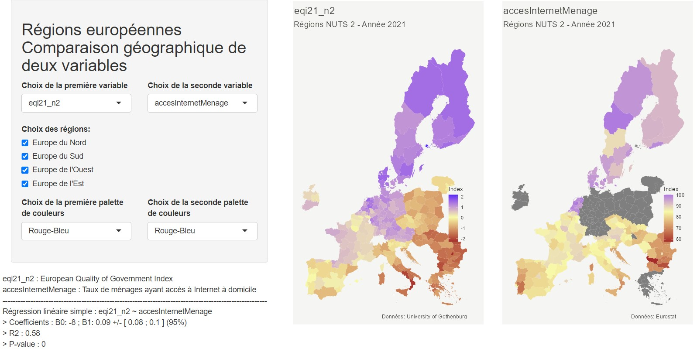

# Analysis of the quality of governance of European regions

### Project goal : 

__Analysis of the quality of governance of European regions__. 

The project's goal is to analyze and explain, using an econometric model, the disparities in governance quality within and between European countries. For this, we use databases from Eurostat and the University of Gothenburg, including:
- https://ec.europa.eu/eurostat/web/regions/data/database
- https://www.gu.se/en/quality-government/qog-data/data-downloads/european-quality-of-government-index)

### Project steps :
- Literature research
- Building the database to address the topic
- Descriptive analysis of the data
- Mapping of European regions (Development of a Shiny application)
- Econometric modeling

### Statistical methods used:
Linear regressions, forward stepwise method (AIC and BIC criteria), k-means method (elbow method), classification tree 

### Libraries used :
ggplot2, stats, dplyr, ggcorrplot, shiny, shinythemes, broom, geojsonio, viridis.
